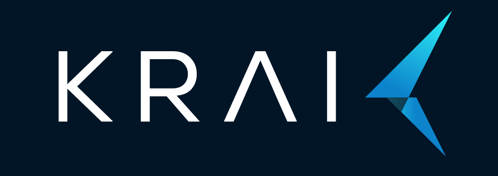

[{ width="400" }](https://krai.ai){target=_blank}

# AXS Overview
Re-design based on the previous CK framework's kernel with a user friendly CLI.

## Installation

Simply download the repository.

```{bash eval=False}
git clone https://github.com/krai/axs ~/axs
Add the path to bashrc.

echo "export PATH='$PATH:$HOME/axs'" >> ~/.bashrc
And source it.

source ~/.bashrc
Upon sucessful installation.

user@laptop:~/axs$ axs
DefaultKernel{}
```

## Working environment

AXS has been tested and supported on the following 64-bit systems:

- MacOS
- Ubuntu
- Windows

Supported python version

- 3.6
- 3.7
- 3.8 (trouble shooting for M1 Mac)
- 3.9
- 3.10 (Developing)